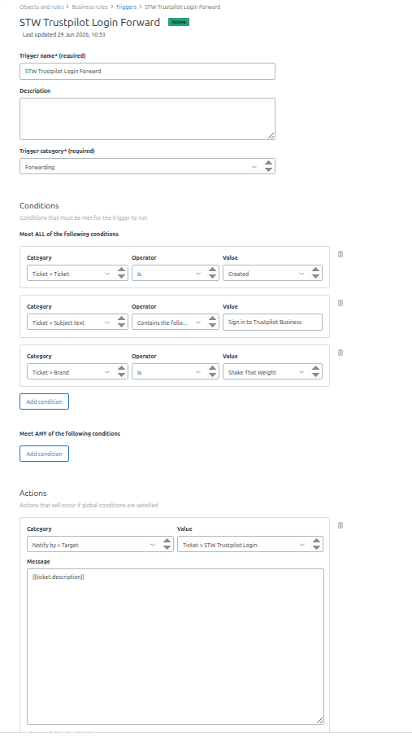

# Trustpilot Connection

This page describes connection workflows with Trustpilot.

## Using Custom API credentials

To connect with customer API credentials follow these steps:
1. Create an app for customer API credentials on Trustpilot on this page: https://businessapp.b2b.trustpilot.com/applications/
- set name as StackTome for example
- set redirect urls exactly as:
- - https://app.stacktome.com
- - https://services.stacktome.com
- - https://services.stacktome.com/auth/v1/trustpilot
- Save the app
2. Open StackTome conections page and click connect on Trustpilot. 
3. Copy the API key and API secret in the fields
4. Click save and login to your Trustpilot account after page reload
5. Approve login on your email and wait for StackTome app to load
6. If you have multiple Trustpilot accounts, choose the one to connect to.
Note, ignore the empty fields for API key/secret as they are set automatically after Trustpilot redirect.

Here is a tutorial how to do it:

<iframe width="640" height="364" src="https://www.loom.com/embed/e1dc0ac63ea8492ca5be29779ae8b30c" frameborder="0" webkitallowfullscreen mozallowfullscreen allowfullscreen></iframe>

## Connecting Trustpilot to StackTome via Forwarding Email (ConnectAsUser)

This guide provides step-by-step instructions on how to connect **Trustpilot** to **StackTome** using the **ConnectAsUser** feature. This method is especially useful if you are on a free account and cannot add additional users directly. 

Instead, you will set up an email forwarding rule (using Google/Gmail as an example) to route your Trustpilot login verification emails to your dedicated StackTome group email address.

---

## Prerequisites
* A valid **Trustpilot** account.
* Your dedicated **StackTome** account group email address (e.g., `hipper@stacktome.com`).
* Access to both your original Gmail inbox and your StackTome group email inbox.

---

## Step-by-Step Instructions

### Step 1: Add the StackTome Forwarding Address in Gmail
Before creating an automated filter, you must authorize Gmail to forward messages to your StackTome email.

1. Open your Gmail settings and navigate to the **Forwarding and POP/IMAP** tab - https://mail.google.com/mail/u/0/#settings/fwdandpop.
2. Click on **Add a forwarding address**.
3. Enter your special StackTome email address (e.g., `hipper@StackTome.com`) and click **Next**.
4. If prompted by Google's security measures (such as Two-Factor Authentication), complete the verification using your mobile device or verification code.
5. Click **Proceed** to send the forwarding request.

### Step 2: Approve the Forwarding Request in StackTome
Google requires a confirmation from the receiving email inbox before forwarding can begin.

1. Go to your **StackTome group email inbox** - example: https://groups.google.com/u/0/a/stacktome.com/g/{account_name} 
- replace {account_name} with your account_name in https://app.stacktome.com/profile.

2. Look for the official confirmation email from Google regarding email forwarding.
3. Open the email and click the **Confirmation Link** inside to approve and accept the forwarding relationship.

### Step 3: Create the Automated Forwarding Filter
Once approved, return to your original Gmail account to set up the automated rule for Trustpilot login emails.

1. Create filter as follows: https://mail.google.com/mail/u/0/#create-filter/from=noreply.login%40trustpilot.com&sizeoperator=s_sl&sizeunit=s_smb
2. Click **Create filter**.
3. Check the box for **Forward it to:** and select your verified StackTome email address from the dropdown list.
6. *(Optional)* If Google prompts you for Two-Factor Authentication verification again, complete it to finalize the rule.
7. Click **Create filter** to activate the automation.

> **Note:** If your newly approved email does not appear in the dropdown list immediately, refresh your Gmail browser tab and try creating the filter again.

---

## Step 4: Verify the Setup
1. Go to the Trustpilot login screen and request a fresh login verification email.
2. Confirm that the login email arrives in your primary Gmail inbox.
3. Open your **StackTome group inbox** and verify that the exact same login email was successfully forwarded and received.

---

## Step 5: Connect inside StackTome (Optional) - Can ask support to do it
1. Within your StackTome dashboard, use your dedicated StackTome email address to initiate the connection.
2. Select the appropriate **Country** you normally use for connecting to Trustpilot.
3. Proceed with **ConnectAsUser**. The system will now automatically capture the forwarded login tokens, and your integration should function smoothly.

---

## Troubleshooting & Support
* **Forwarding email not showing up?** Refresh your browser window after confirming the link in Step 2. Google sometimes requires a hard refresh to update the authorized forwarding dropdown.
* **Two-Factor Authentication Prompts:** Google may ask for security verification multiple times during this setup. This is standard behavior for email routing security.

If you encounter any issues or have additional questions, please reach out to **StackTome Support**.

<iframe width="640" height="364" src="https://www.loom.com/embed/8f97d1f1a92e4e7fb7c7c7219a6bfe9b" frameborder="0" webkitallowfullscreen mozallowfullscreen allowfullscreen></iframe>

---

## Connecting Trustpilot to StackTome via Forwarding Email (Outlook / Microsoft 365)

This guide provides step-by-step instructions on how to connect **Trustpilot** to **StackTome** by forwarding your Trustpilot login emails using an **Outlook / Microsoft 365** inbox rule — the same idea as the Gmail method above, adapted for Outlook. This is useful if you are on a free Trustpilot account and cannot add additional users directly, and your Trustpilot login inbox is hosted on Outlook or Microsoft 365 rather than Gmail.

Instead, you will set up an inbox rule in Outlook to forward your Trustpilot login verification emails to your dedicated StackTome group email address.

---

## Prerequisites
* A valid **Trustpilot** account, with its login inbox on **Outlook** or **Microsoft 365**.
* Your dedicated **StackTome** account group email address (e.g., `demo@stacktome.com`).
* Access to both your Outlook inbox and your StackTome group email inbox.
* **Microsoft 365 Business / Enterprise tenants only:** an admin must first allow automatic external email forwarding at the tenant level. By default, Microsoft 365 blocks outbound auto-forwarding to external addresses as an anti-spam measure, and an inbox rule alone will not override this. See Microsoft's guide: [Configure outbound spam filter policies to allow automatic forwarding to external recipients](https://learn.microsoft.com/en-us/defender-office-365/outbound-spam-policies-external-email-forwarding).

---

## Step-by-Step Instructions

### Step 1: Trigger a Trustpilot Login Email
1. Go to the Trustpilot Business login page and request a sign-in. Trustpilot will send a login email containing a sign-in link.
2. Open your Outlook inbox and locate this email.

### Step 2: Create the Forwarding Rule in Outlook
1. Open the Trustpilot login email, click the **three dots (⋯)** on the message, then select **Advanced Actions > Create Rule**, and click **More Options** to open the full rule editor.
2. Under **Conditions**, scope the rule to Trustpilot login emails only (for example, sender contains `noreply.login@trustpilot.com`, or subject contains "Sign in to Trustpilot Business") so that other emails are not forwarded.
3. Under **Actions**, choose **Forward to**, then enter your dedicated StackTome account email address — this is your account name tagged `@stacktome.com` (e.g. for an account named `julies-shop`, use `julies-shop@stacktome.com`).

### Step 3: Approve the Forwarding Address (first time only)
1. If this StackTome address hasn't been used for forwarding before, Outlook will prompt you to approve/verify the new external forwarding address before it takes effect.
2. Click **Save**, and make sure the rule is **enabled**.

---

## Step 4: Verify the Setup
1. Open your StackTome group email inbox and confirm no email has been forwarded there yet.
2. Go back to Trustpilot and trigger a fresh login email.
3. Within about a minute, the forwarded login email should appear in the StackTome group inbox, confirming the setup works and giving the StackTome app the link it needs to connect to your Trustpilot account.

---

## Step 5: Connect inside StackTome (Optional) - Can ask support to do it
1. Within your StackTome dashboard, use your dedicated StackTome email address to initiate the connection.
2. Select the appropriate **Country** you normally use for connecting to Trustpilot.
3. Proceed with **ConnectAsUser**. The system will now automatically capture the forwarded login tokens, and your integration should function smoothly.

---

## Troubleshooting & Support
* **Forwarded email never arrives?** First check that automatic external forwarding is allowed at the tenant level (see Prerequisites) — this is the most common blocker on Microsoft 365 Business/Enterprise accounts, since org-wide policy silently blocks external auto-forwarding by default, independent of your inbox rule.
* **Rule saved but nothing forwards:** double-check the rule's condition matches the real Trustpilot sender/subject, and that the rule shows as **enabled**, not just saved.
* **New forwarding address rejected:** Outlook requires one-time approval before it will forward to a brand-new external address — look out for that approval prompt when the rule is first created.

If you encounter any issues or have additional questions, please reach out to **StackTome Support**.

<iframe width="640" height="364" src="https://www.loom.com/embed/ec59af49b0de48a7ac6747f305f530e8" frameborder="0" webkitallowfullscreen mozallowfullscreen allowfullscreen></iframe>

---

## Connecting Trustpilot to StackTome via Forwarding Email (Zendesk)

This guide provides step-by-step instructions on how to connect **Trustpilot** to **StackTome** by forwarding your Trustpilot login emails through **Zendesk**, using a Zendesk email **target** plus a forwarding **trigger** instead of a native mailbox rule. This is useful if your Trustpilot login inbox is a Zendesk-managed support address rather than a personal mailbox.

---

## Prerequisites
* A valid **Trustpilot** account, with its login inbox routed through Zendesk.
* Your dedicated **StackTome** account group email address (e.g., `demo@stacktome.com`).
* **Zendesk Admin Center** access, to create Targets (Apps and Integrations) and Triggers (Objects and Rules / Business Rules).

---

## Step-by-Step Instructions

### Step 1: Create an Email Target
1. In Zendesk, go to **Admin Center > Apps and Integrations > Targets**.
2. Add a new target and select **Email target**.
3. Set the target's email address to your dedicated StackTome account email address (e.g., `demo@stacktome.com`) and give it a subject line describing the forward, e.g. "Trustpilot login".
4. Test the target to confirm delivery works, then **create** it.

### Step 2: Create the Forwarding Trigger
1. Go to **Admin Center > Objects and Rules > Business Rules > Triggers**, then click **Create New Trigger**.
2. Set a **Trigger name** (e.g. "STW Trustpilot Login Forward"), an optional description, and a trigger **category** (e.g. "Forwarding").
3. Under **Conditions - Meet ALL of the following conditions**, add:
   - `Ticket > Ticket` **Is** `Created`
   - `Ticket > Subject text` **Contains the following** `Sign in to Trustpilot Business` (match the Trustpilot login email's subject)
   - `Ticket > Brand` **Is** `<your brand>` (only needed if you run multiple brands on the same Zendesk instance)
4. Under **Actions**, add `Notify by > Target`, set the value to the email target created in Step 1, and in **Message** enter `{{ticket.description}}` so the full email body — including the Trustpilot login link — is forwarded.
5. Click **Create** to save and activate the trigger.

Example of a working trigger configuration:

---

## Step 3: Verify the Setup
1. Trigger a real Trustpilot login email addressed to your Zendesk support address, or create a test ticket in Zendesk with a matching subject and a dummy Trustpilot-style link in the description, submitted as **New**.
2. Confirm a new ticket is created that matches the trigger's conditions.
3. Check your StackTome group email inbox (the email target from Step 1) — the forwarded message, containing the ticket description, should arrive shortly after the ticket is created.

---

## Step 4: Connect inside StackTome (Optional) - Can ask support to do it
1. Within your StackTome dashboard, use your dedicated StackTome email address to initiate the connection.
2. Select the appropriate **Country** you normally use for connecting to Trustpilot.
3. Proceed with **ConnectAsUser**. The system will now automatically capture the forwarded login tokens, and your integration should function smoothly.

---

## Troubleshooting & Support
* **No ticket created:** confirm the trigger's subject-text condition matches the real Trustpilot login email subject (a "contains" match is safest), and that the **Brand** condition, if used, matches the ticket's brand.
* **Ticket created but nothing forwarded:** check that the email target's address is correct and was verified in Step 1, and that the trigger's action references that same target.
* **Testing without waiting for a real login email:** you can dry-run the trigger by manually creating a ticket with a matching subject and a description containing a dummy link.

If you encounter any issues or have additional questions, please reach out to **StackTome Support**.

<iframe width="640" height="364" src="https://www.loom.com/embed/066359f809994f5d87a08818e2d449ba" frameborder="0" webkitallowfullscreen mozallowfullscreen allowfullscreen></iframe>